# Compare Camp overhaul audit

Date: 2026-10-02. Surface: native tvOS Compare Camp. Capture method: XCTest with Siri Remote commands on the Apple TV 4K 1080p simulator; exported screenshots inspected from the saved PNGs. The implementation stayed in the existing SwiftUI app.

## Initial flow and findings

1. **Compare two groups - usable, narrow.** Large answer targets, obvious focus, and untimed counting provide a calm starting point. Small lightbulb glyphs fill only part of tall trays. One subject and one question form limit exploration.

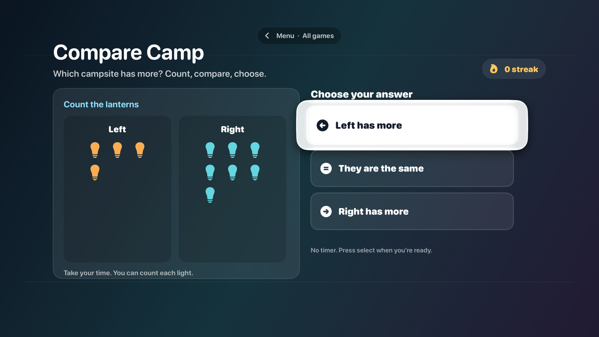

2. **Wrong answer - needs improvement.** The selected incorrect answer turns amber and all answers become disabled. Numbers appear, but the groups are not paired and the correct relationship is not visually demonstrated. The only next action is Next, so the child cannot revise the same comparison.

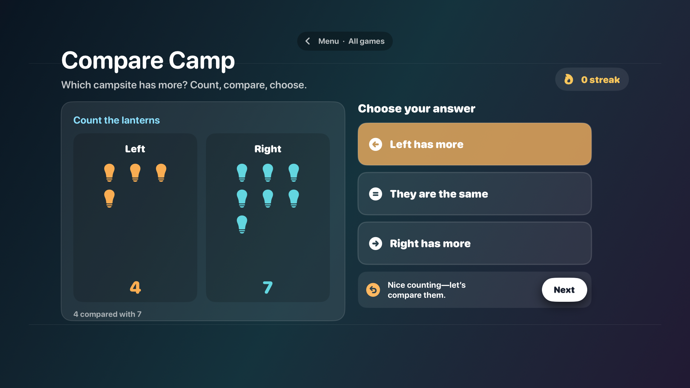

3. **Next round - usable, repetitive.** Advancing works and focus returns to the first choice. Inspection of the source confirms a six-pair sequence that repeats with no category choice, support activity, natural finish, or saved exploration record. The visible streak makes a mistake reset the reward.

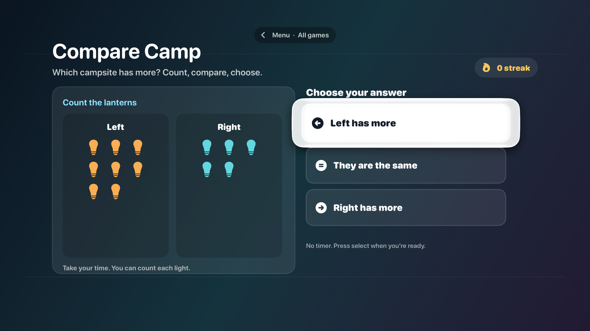

## Focused implementation areas

- **Content:** 24 camps across six regions; six trails and three quantity ranges; varied deterministic quantity journeys. Eleven new generated assets support camp atmosphere and clean counting objects. Reused bird medallions were replaced after visual inspection found numbers unrelated to the mathematical question.
- **Learning loop:** Manipulate groups, compare pictured quantities, meet signs, then transfer to another region. Incorrect attempts remain open. Counting, pairing and the guide supply evidence and teaching without selecting the answer.
- **Play and progress:** Eight-stop trails, a guide character, optional object transitions, a badge finish, varied replay, and a saved exploration passport. No timer or punitive streak.
- **TV interaction:** Explicit directional links reach the support row and Start action. New rounds restore focus after their controls mount. A custom button style keeps focus inside each target. Objects grow for smaller quantity ranges while staying equal in size across the two groups.

## Resulting flow and health

1. **Choose a camp - healthy.** Six region shelves expose 24 distinct camps. Selected region and remote focus have separate outlines, and the four-card shelf stays within the screen. The generated fox and backdrop introduce the setting without becoming counting evidence.

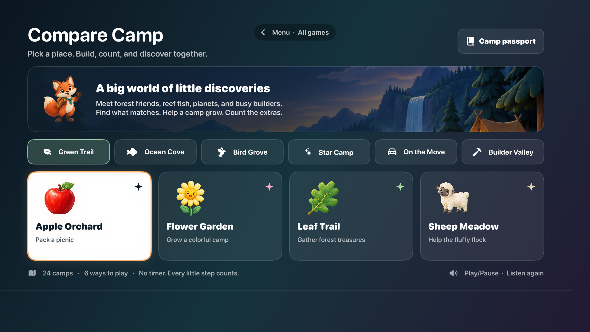

2. **Choose a trail and group size - healthy.** Six activities and three ranges are visible together. Selection persists until Start; directional navigation reaches Start from every range choice. The combinations provide 432 configurations, with no performance gate.

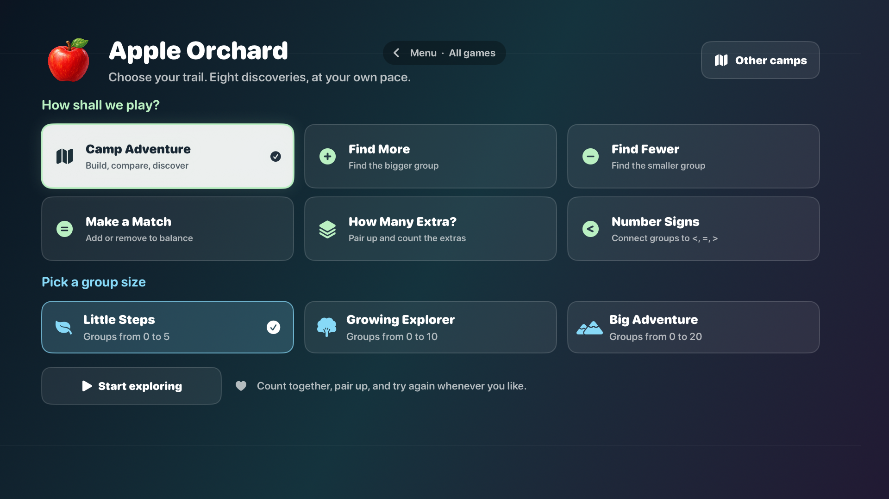

3. **Build, count and revise - healthy.** Both groups use the same object size. Add/Take changes one left-side item, the right group stays fixed, and the check uses current quantities. Support controls are reachable from the answer panel. An incorrect check stays open; counted items gain tally markers, paired items gain link markers, and unmatched items gain plus markers. The distinction uses shape as well as color.

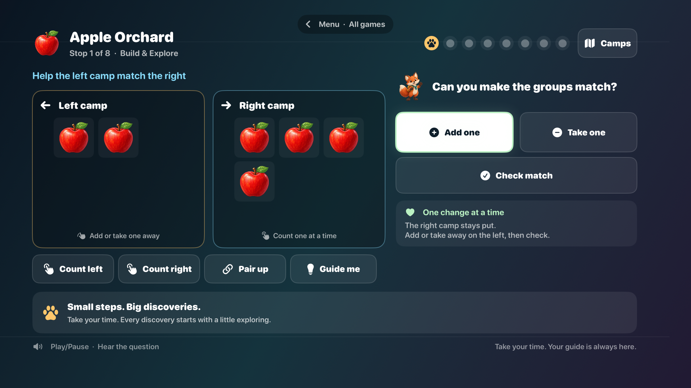

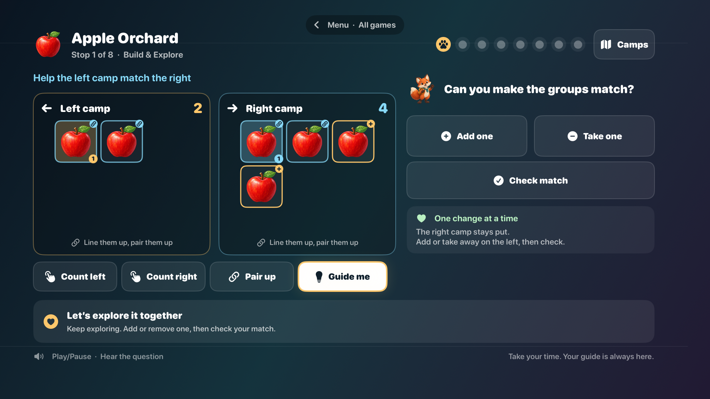

4. **Compare pictures - healthy.** More, fewer and equal are real alternatives. Empty groups have an explicit empty state. A miss invites another attempt and leaves all answers and support available. Next appears only after solving; advancing restores focus when the new controls mount.

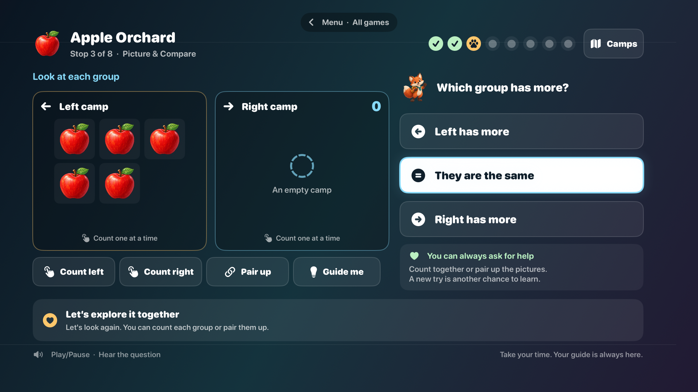

5. **Connect quantities to signs - healthy.** Numbers appear alongside pictured groups and large sign choices. The guide teaches the sign relationship aloud, and counting/pairing remain available. The child reaches this stage after manipulating and comparing quantities.

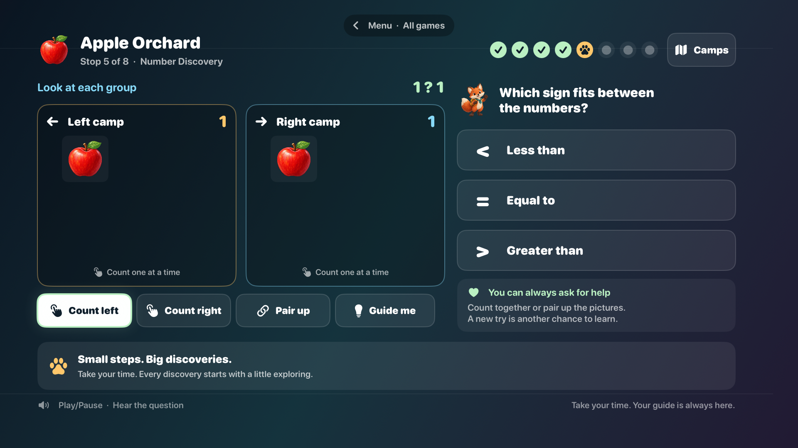

6. **Transfer to another context - healthy.** The last two adventure stops change region and subject while keeping the controls familiar. The tested adventure transfers into trains, then a different subject, and asks both a comparison and an extras question.

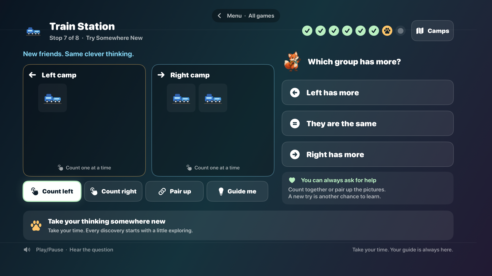

7. **Finish, replay and revisit the passport - healthy.** Eight solved discoveries earn a badge and the original camp sticker. Replay offers a fresh quantity journey; the passport survives app relaunch and records the new completion once. The final celebration inset clears the root Menu overlay while keeping all actions and the footer in view. The passport screenshot shows two completed trails after the focused rerun.

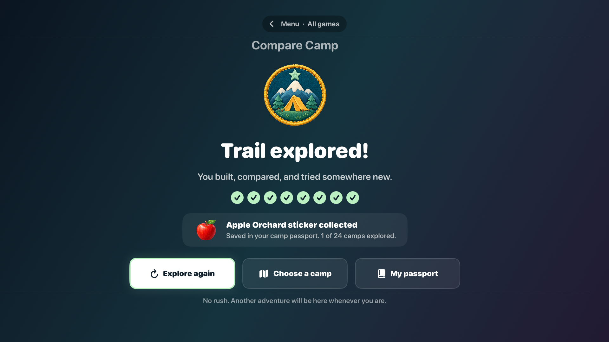

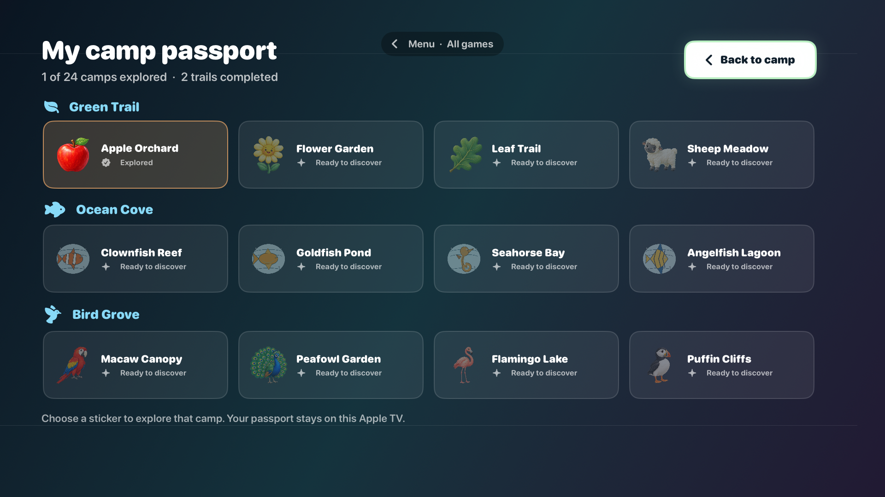

## Additional content and boundary evidence

All six shelves and their 24 cards were reached with native remote commands. Clean generated bird subjects replace the unrelated numbers found during earlier image review.

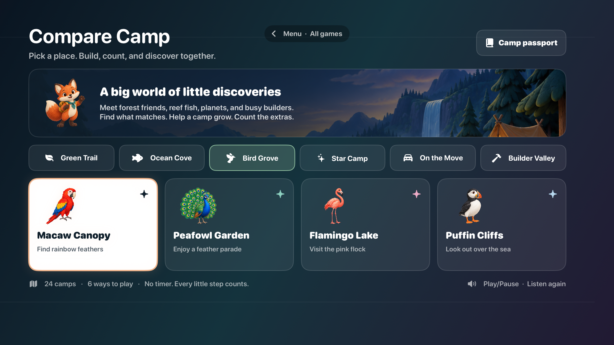

Twenty objects fit in a four-row tray, and Add becomes unavailable at the upper bound. Native tests also exercised zero, groups up to ten, and solving after reaching the bound. The twenty-object range needs a couch-distance device check before treating its readability as established.

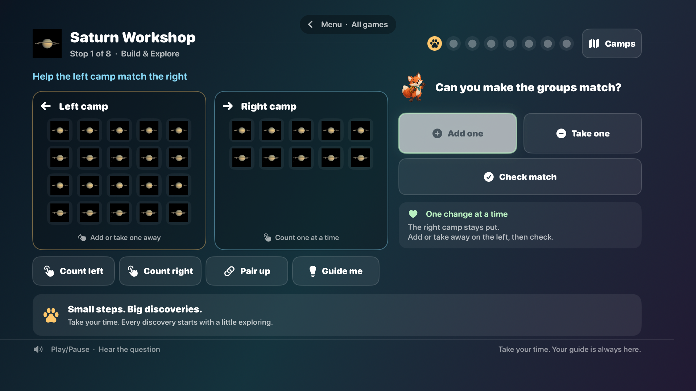

## Native verification

- **20 unit tests passed**, four suites, including 10,368 generated-round checks across all camps, activities and ranges; asset loading; retry/count/build guards; replay; completion; saved progress and corrupt-data recovery. Bundle: `.artifacts/CompareCampUnitAssetsFinal.xcresult`.
- **Three remote UI tests passed**, zero failures, 213.945 seconds. They cover the complete adventure, all region shelves and 24 camps, ranges up to 10 and 20, real wrong-answer retries, counting/pairing/help, signs, transfer, completion/replay, passport reload, Play/Pause and Menu reentry. Bundle: `.artifacts/CompareCampVerified.xcresult`.
- **The final adventure rerun passed**, zero failures, 123.951 seconds, after the narrow celebration inset and passport grammar fixes. Its celebration and passport captures are the accepted final evidence above. Bundle: `.artifacts/CompareCampFinalCelebration.xcresult`.
- Native tvOS builds passed; XcodeGen generated project additions. All six printable pages were rendered and visually inspected. The content manifest's 24 entries and all eleven new asset hashes were verified.

## Verification limits

The screenshots establish visible layout, content, and state transitions. Automated remote tests establish the tested navigation paths and interactions. They do not establish couch-distance comfort, speaker narration intelligibility, physical Siri Remote feel, or complete VoiceOver/Reduce Motion accessibility. These remain device checks, rather than claims inferred from screenshots.
